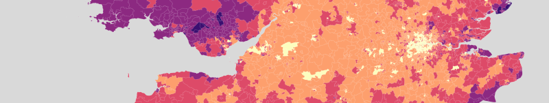
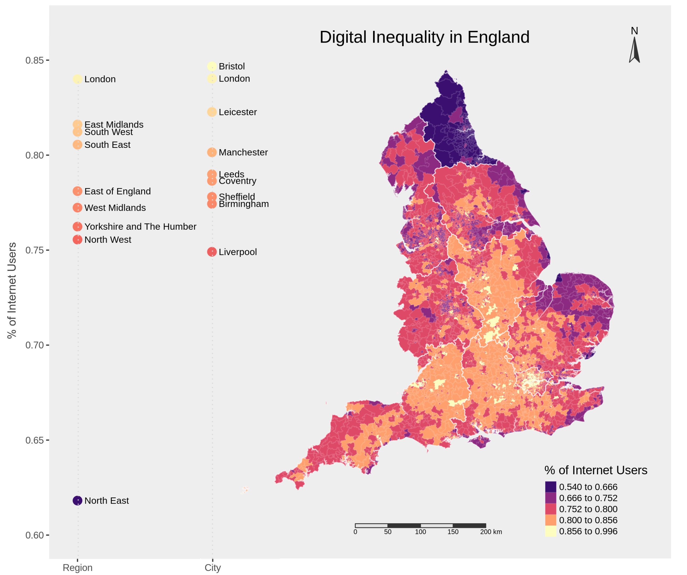
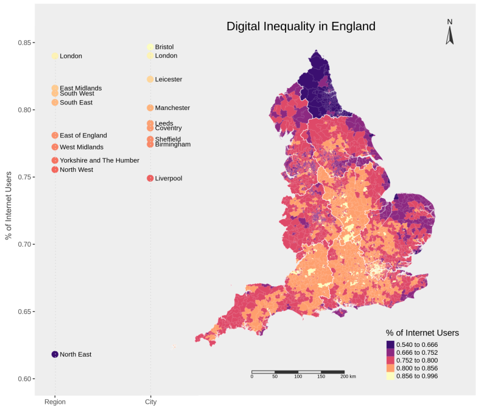
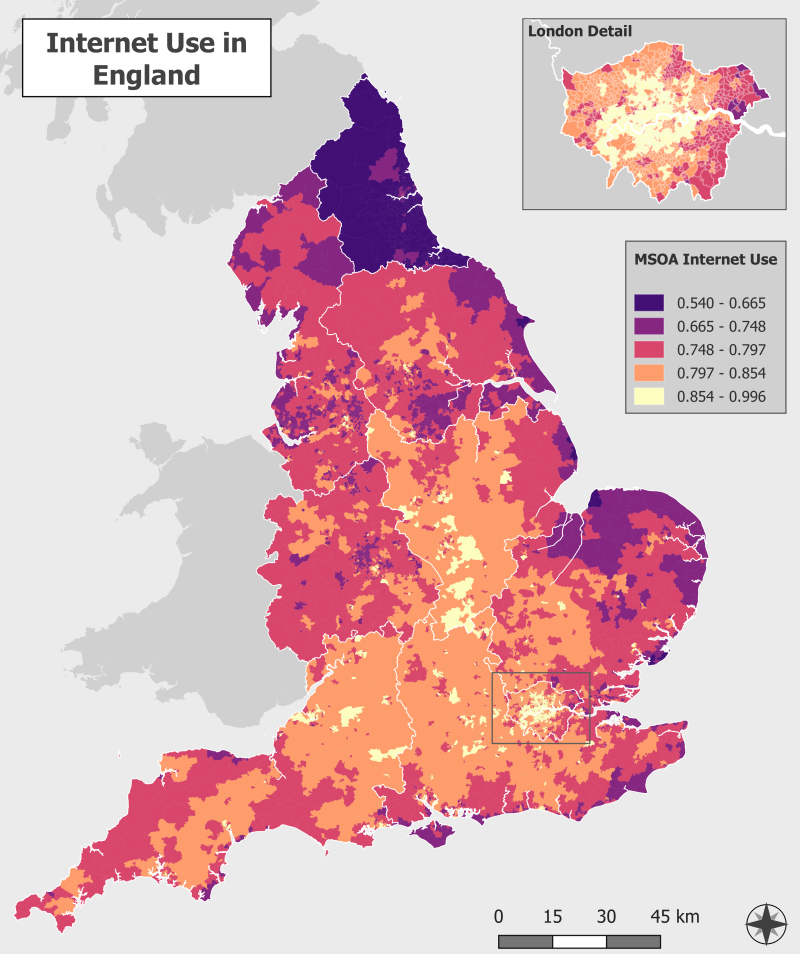

```{r setup, include=FALSE}
knitr::opts_chunk$set(echo = TRUE)
```


# Mapping Digital Inequality in England

```{r echo=FALSE, message=FALSE, warning=FALSE, out.width="100%", paged.print=FALSE}

#
```
<!-- <center> -->
<!--  -->
<!-- </center> -->

## Data Sources   

Digital inequality is important to understand in a world which has been reshaped dramatically by the internet, but examining geographical dimensions of this inequality has been  made challenging by the lack of sub-national scale data. The maps here use data from [@blank_local_2018], who use Small Area Estimation to combine results from the Oxford Internet Survey (OxIS) with Census data. Both use Output Areas as their foundational geographical unit, and so by modelling internet use with the small but rich OxIS results and applying this model to census data the authors are able to “use the strengths of one to offset the gaps in the other” (ibid, p.87).

The resulting OA-level dataset can be aggregated to different regional scales to understand the geographical distribution of internet use. This of course is a direct replication of the scale part of the Modifiable Areal Unit Problem (MAUP), which means that as we move up the spatial hierarchy variation from the original dataset is lost, which can cause problems with measuring correlation [@wong_modifiable_2009]. This shouldn’t be too problematic in the visual outputs here; in fact aggregation should help smooth some of the errors in the model’s estimates for smaller OAs [@blank_local_2018]. These maps display results at MSOA level in order to strike a balance between this smoothing and preserving the granularity of the original data.

## Workflow
### Data Wrangling

```{r data, message=FALSE, warning=FALSE, paged.print=FALSE}
library(sf)
library(maptools)
library(tmap)
library(tmaptools)
library(ggplot2)
library(viridis)
library(tidyverse)
library(citr)
library(kableExtra)

# read in data and reference tables, there are 227759 OAs in England, Wales & Scotland
data = read_csv('data/internet_use_esrc.csv')
pop_data = read_csv('data/census_pop_2011_all.csv')
oa_msoa = read_csv('data/ref_OA_to_MSOA.csv')
oa_region = read_csv('data/ref_OA_to_region.csv')
msoa_cities <- read_csv('data/ref_MSOA_to_cities.csv')

```

The first step aims to build a flexible underlying dataset which can be summarised and mapped at our scale of choice. In R, TidyVerse helps us achieve this in just a few steps:


```{r data-wrangling, message=FALSE, warning=FALSE}

# join data to both reference tables for MSOA, region and cities, as well as population data 
data <- data %>% 
  left_join(oa_msoa, by=c('oa11'='OA11CD')) %>%
  left_join(oa_region, by=c('oa11'='OA11CD')) %>%
  left_join(pop_data, by=c('oa11'='oa_code')) %>%
  left_join(msoa_cities, by=c('MSOA11CD'= 'MSOA11CD'))

# get rid of columns we don't need
data <- select(data, -c(phhreadr, pmobmail2, pu_accmob))

# check OA hasn't been duped at all by the left joins
sprintf('number of unique OAs: %s', n_distinct(data$oa11))

```
<br>
<div class="verysmall">
```{r show-data, echo=FALSE, message=FALSE, warning=FALSE, paged.print=FALSE}

kable(data[1:3,], caption = 'The first few rows of the joined up dataset') %>%
  kable_styling() %>%
  scroll_box(width = "100%")
```
</div>
<br>
```{r summarising, message=FALSE, warning=FALSE}
# Summarise internet use to population-weighted average at MSOA level
# group by MSOA, summing population and internet users, then calculating the % of internet users
# keep region and cities in for further optional filtering 
data_msoa <-  data %>% 
    filter(!is.na(RGN11NM)) %>%
    mutate(int_pop = pusenet*people) %>%
    group_by(MSOA11CD) %>%
    summarise(t_pop = sum(people), t_int_pop = sum(int_pop), 
              pusenet_msoa = t_int_pop/t_pop, RGN11NM = max(RGN11NM),
              TCITY15NM=max(TCITY15NM))
```
<br>
<div class="verysmall" align="left">
```{r show-data2, echo=FALSE, message=FALSE, warning=FALSE, paged.print=FALSE}
kable(data_msoa[1:3,], caption = 'The first few rows of the summarised dataset') %>%
  kable_styling() %>%
  scroll_box(width = "100%")
```
</div>
<br>
Joining data in QGIS is straightforward, made simple for beginners with the GUI. However, multiple joins become very convoluted and SQL knowledge is required for aggregation. It is usually easier to do this sort of joining and summarising in R and read the resulting dataset directly into QGIS. The process and logic is also more transparent this way, and its flexibility means the data can easily be summarised to different levels by just changing a few variable names.   

### Visualisation   
The maps have some common design choices: the perceptually uniform [viridis](cran.r-project.org/web/packages/viridis/vignettes/intro-to-viridis.html) magma colourmap has a wide color range to make differences stand out [@van_der_walt_matplotlib_nodate]; the sequential nature of this colourmap also meets my requirements of highlighting the differences between the extremes of the distribution [@brewer_spectral_1997]; and five jenks breaks portrayed the pattern well (see fig ###).
<br><br>
Beyond these, design diverged to make use of the strengths of each tool. In R the powerful ggplot and the flexible dataset are used to provide information about the cities and regions that is hard to interpret from the map. This is achieved to some extent in QGIS by providing a zoomed in view of London. The QGIS GUI makes customising outputs easy and provides endless style options. Such fine-tuning is harder in R, requiring detailed knowledge of Tmap elements, furthermore re-generating the whole map for small adjustments makes instant visual feedback for design tweaks hard.
<br>
```{r shapefiles, message=FALSE, warning=FALSE}

# read in shape files
msoa_shp <- read_shape('shapes/MSOA/Middle_Layer_Super_Output_Areas_December_2011_Generalised_Clipped_Boundaries_in_England_and_Wales.shp')
reg_shp  <- read_shape('shapes/regions/Regions_December_2016_Generalised_Clipped_Boundaries_in_England.shp')
countries_shp <- read_shape('shapes/countries/Countries_December_2017_Generalised_Clipped_Boundaries_in_UK.shp')

# inner join msoa to data
msoa_shp_all <- msoa_shp %>% inner_join(data_msoa, by= c('msoa11cd'='MSOA11CD'))
```

``` {r map, message=FALSE, warning=FALSE}
# colour palette
pal <- viridisLite::magma(5, begin = 0.2, end = 1)

# build map in tmap
uk_internet <- tm_shape(msoa_shp_all) + tm_fill(col='pusenet_msoa', palette=pal, style='jenks', title='% of Internet Users') +
  tm_borders(col='white', alpha=0.1, lwd=1) +
  tm_style('gray', bg.color='#eeeeee') +
  tm_shape(reg_shp) + tm_borders(col='white', lwd=1, alpha=0.5) +
  tm_compass(position = c('right', 'top'), color.light = 'grey90', color.dark='grey20') +
  tm_scale_bar(position=c('center','bottom'), color.light = 'grey90', color.dark='grey20') +
  tm_layout(title='Digital Inequality in England', frame=FALSE,
            title.position = c("center", "top"), 
            legend.position = c("right", "bottom"),
            inner.margins = c(0.1, 0.1, 0.1, 0.1))

# save as png
# tmap_save(uk_internet, 'out_eng_internet_access.png', height=7)
```

#### R Map
<br>
<!-- [](cran.r-project.org/web/packages/viridis/vignettes/intro-to-viridis.html) -->
]
<br><p class=caption>
Map produced in R, combined with ggplot chart visualisation of scores for regions and cities
</p><br>


#### QGIS Map 
<br>
<!-- [](cran.r-project.org/web/packages/viridis/vignettes/intro-to-viridis.html) -->
]
<br><p class=caption>
Map produced in QGIS, with extra detail of London
</p><br>

## Outcome and Implications   
As Wood [@fels_rethinking_2010] writes, maps do not ‘reveal’ but ‘propose’; there is no such thing as an absolute reality to represent, or no innocent way to see it, thus we should approach the results of mapping critically. In this instance we should be cautious of the data source; because it is essentially internet use predicted using census variables, we will not see anomalies where internet use diverges from how we expect it to relate to these demographic indicators, which arguably is one of the most interesting outcomes of this sort of exercise. Further caution is advised in interpretation - the strong geographic patterns displayed in the maps make it easy to leap to assumptions of causality, but what has been mapped is not an independent ‘effect’ but one of many factors which can both influence and be influenced by various forms of inequality. 
<br>
<br>


add some detail about the survey question
** insert link to detailed map

## Appendix
```{r message=FALSE, warning=FALSE, paged.print=TRUE}
# CREATING NEW MAPS IN R WITH THE DATASET IS EASY

# create list of cities we're interested in then create new table filtered by them
cities_of_interest <- c('London', 'Birmingham', 'Liverpool', 'Leeds', 'Sheffield', 'Bristol', 'Manchester', 'Leicester', 'Coventry')
msoa_cities <- filter(data_msoa, TCITY15NM %in% cities_of_interest)

# join the new cities dataset to the msoa shape file
msoa_cities_shp <- msoa_shp %>% inner_join(msoa_cities, by= c('msoa11cd'='MSOA11CD'))

# reuse the base tmap code, with an added facet element
tm_shape(msoa_cities_shp) +
  tm_fill(col='pusenet_msoa', palette=pal, style='jenks', title='% of Internet Users') +
  tm_facets(by='TCITY15NM') + tm_style('gray')
```


```{r message=FALSE, warning=FALSE, paged.print=TRUE}
# GGPLOT CHART FOR R MAP

# summarise internet scores to city level and create new place columns in output table
city_internet <- msoa_cities %>% 
  group_by(TCITY15NM) %>% 
  summarise(pop = sum(t_pop), int_pop = sum(t_int_pop), pusenet=int_pop/pop) %>%
  mutate(place_type = 'City') %>%
  rename(place = TCITY15NM)

# summarise to region, keeping output in same format as city summary
region_internet <- data_msoa %>% 
  group_by(RGN11NM) %>% 
  summarise(pop = sum(t_pop), int_pop = sum(t_int_pop), pusenet=int_pop/pop) %>%
  mutate(place_type = 'Region') %>%
  rename(place = RGN11NM)

# create new table from both tables above unioned together
place_scores <- bind_rows(city_internet, region_internet)

# theme for use in ggplot below
mytheme <- theme(panel.grid.minor = element_blank(), panel.grid.major = element_blank(),
                 axis.line.x = element_blank(), legend.position='none', 
                 axis.title = element_blank(), panel.background = element_rect(fill="#eeeeee") )

cities_chart <- ggplot(place_scores, aes(place_type, pusenet, color=pusenet, label=place)) +
  geom_point(size=3.5) + ylim(0.6, 0.85) +
  geom_text(aes(label=place), hjust=0, nudge_x=0.03, size=3, color='black') +
  scale_color_viridis_c(option = "A", begin = 0.2, end = 1) +
  mytheme

# save chart as png
ggsave('place_scores_chart.png', plot=cities_chart, height=7)

cities_chart

```

## References 